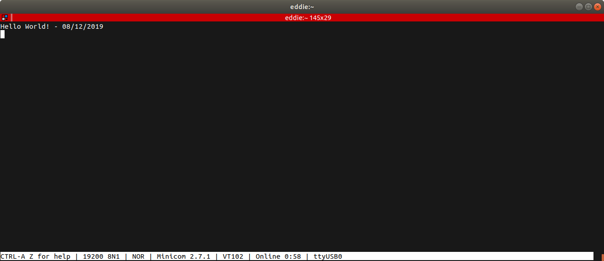
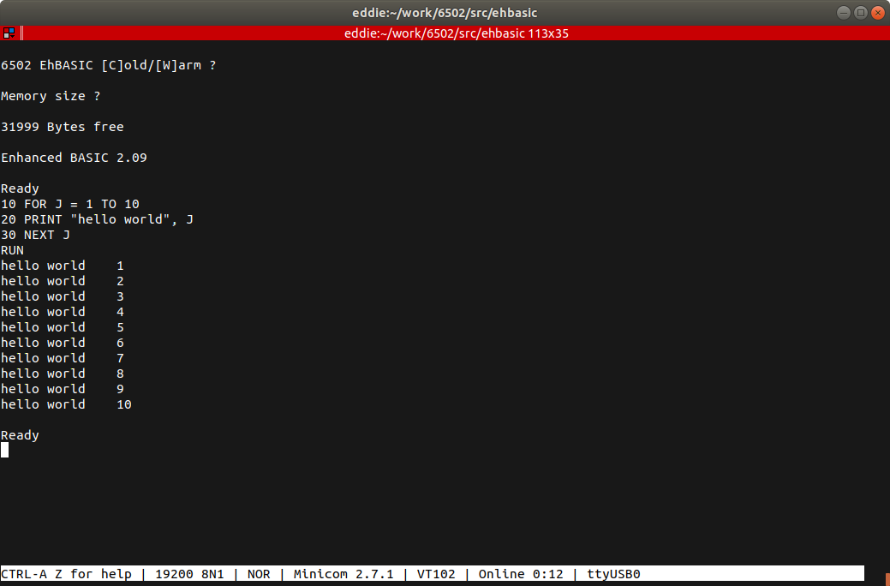
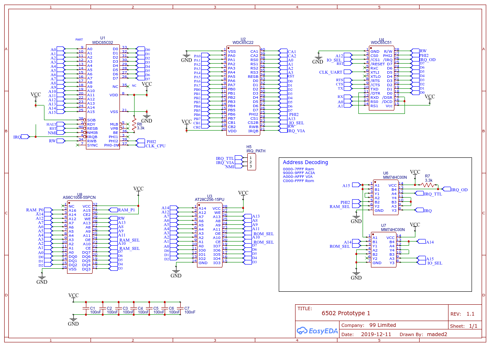
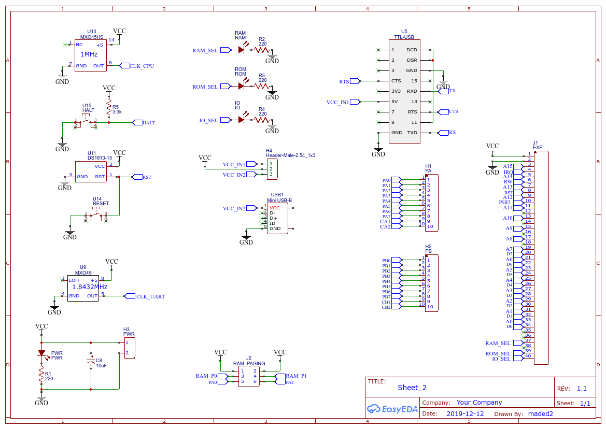
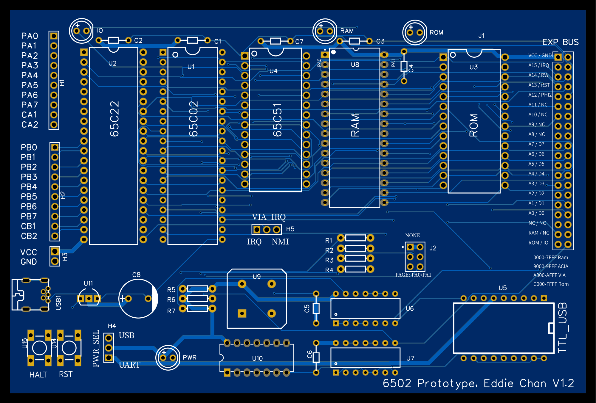
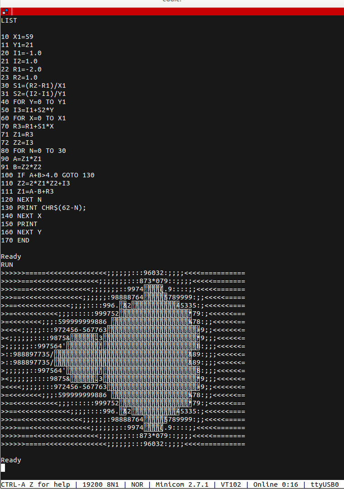
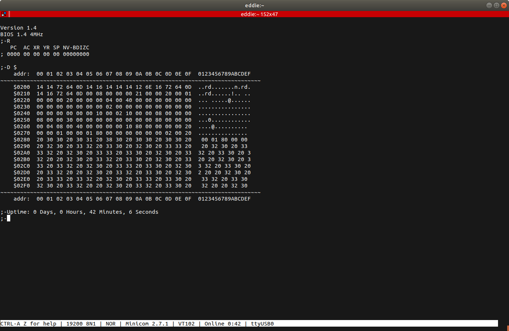

# 6502 Homebrew - the adventure begins

## Goals
* Learn/Design/Build a 6502 based computer with Video, Sound, Storage and simple I/O (Serial, Keyboard)
* Design and build a Multi-tasking os with memory protection using memory bank switching per task
* Possible multi-cpu design in the future

## Plans
* Using Perf board to get the initial hardware running
* Get minimal software running to validate the hardware design
* Prototype PCB to lockdown the Hardware design
* Full OS work using lockdown hardware

---
*11/11/2019* Ordered lots of ICs from AliExpress on single day discounts.  6502, 6522, SRAM, EEPROM and tools.  These parts are for prototyping.

---
*15/11/2019* [TL866ii+ Universal Programmer](http://www.xgecu.com) ($53.12) arrived from AliExpress

Ordered bunch of *real* parts from Mouser
* W65C02S6TPG-14
* W65C22S6TPG-14
* W65C51N6TPG-14
* Various Clock Oscillators - 1Mhz, 2Mhz, 4Mhz, 8Mhz, 10Mhz

these parts have static core design which will allow very slow clock signal.

Downloaded and build/install [minipro](https://gitlab.com/DavidGriffith/minipro/).   
An open source EEPROM programming software.  Built it on my linux desktop.  With minipro installed, look like the fireware on the TL866ii+ needs to be updated.

Looks like I need to install the Windows Software to get access to the new Firmware.

---
*15/11/2019* First order from AliExpress arrived today.  

* 2 x 6502 ($0.77 each) - need testing
* 4 x 6522 ($0.76 each) - need testing
* 3 x Perf Board with Power Adaptor ($4.26 each)
* 5 x 62256 32KB SRAM ($1.12 each)
* 5 x AT28C256-15PU 32KB EEPROM ($3.20 each)
* 10 x 74LS00P NAND Gates ($1.12 for 10) 

Testing EEPROM using the TL866ii+ by reading and writing to the EEPROM with zero.  Looks like all the chips are used with content on them.

---

*17/11/2019* First prototype on Breadboard

  
Orders from Mouser arrives.   Real 65c02, 65c22, 65c51 with several Clock Oscillators, DS1813

More logic chips and dram from Aliexpress

*24/11/2019* Second prototype on Breadboard.  Much more tidy

*30/11/2019* New Tools for this build

Inline USB voltage / current monitor.  Use it to monitoring abnormal voltage drop or high current load.  This generally indicts that wrong connection somewhere in the circuit.
 

Digital Microscope for the PCB / soldering work later in the project

Digital Oscilloscope / Multimeter / Waveform generator

*30/11/2019*  Third prototype on the breadboard.  Added logic for address decoding.  6502, 32kb Ram, 16kb Rom.  Ready for some coding of the initial boot rom.

*8/12/2019*  Added 6522 for the LEDs display.  Added 6551 for Serial comms using FTDI 232R TTL to USB converter.   It now prints "Hello World!" to the serial connection and echo any inputs.  Essentially a working computer with I/O.  This prototype running at 1MHz drawing about 250mA.

ehBasic is now working

*5/1/2019*  Captured the Schematic using EasyEDA and designed the PCB.  After several iterations the version 1 final design.

*16/1/2019*  Final assembled V1.2 board.  

*16/1/2019* 3 generation of the boards.

*16/1/2019* Mandelbrot Set running using Lee Davidson's Enhanced Basic

*16/1/2019* [C02 Monitor](https://github.com/floobydust/65C02-SBC1) V1.4 by Kevin Maier is also working.
