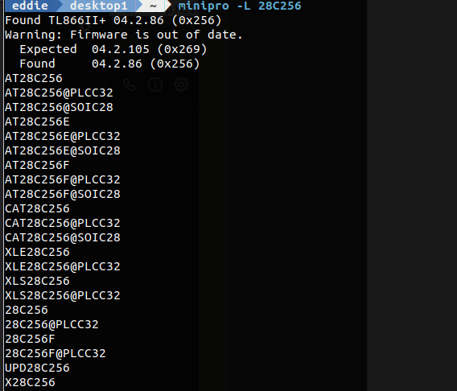

# 6502 Homebrew - the adventure begins

## Goals
* Learn/Design/Build a 6502 based computer with Video, Sound, Storage and simple I/O
* Design and build a Multi-tasking os with memory protection using memory bank switching per task
* Possible multi-cpu design in the future

---
*11/11/2019* Ordered lots of ICs from AliExpress on single day discounts.  6502, 6522, SRAM, EEPROM and tools.  These parts are for prototyping.

---
*15/11/2019* TL866ii+ Universal Programmer arrived

Ordered bunch of *real* parts from Mouser
* W65C02S6TPG-14
* W65C22S6TPG-14
* W65C51N6TPG-14
* Various Clock Oscillators - 1Mhz, 2Mhz, 4Mhz, 8Mhz, 10Mhz

these static have static core design which will allow very slow clock signal.

Downloaded and build/install [minipro](https://gitlab.com/DavidGriffith/minipro/).   
An open source EEPROM programming software.  Built it on my linux desktop.  With minipro installed, look like the fireware on the TL866ii+ needs to be updated.

Looks like I need to install the Windows Software to get access to the new Firmware.

---
